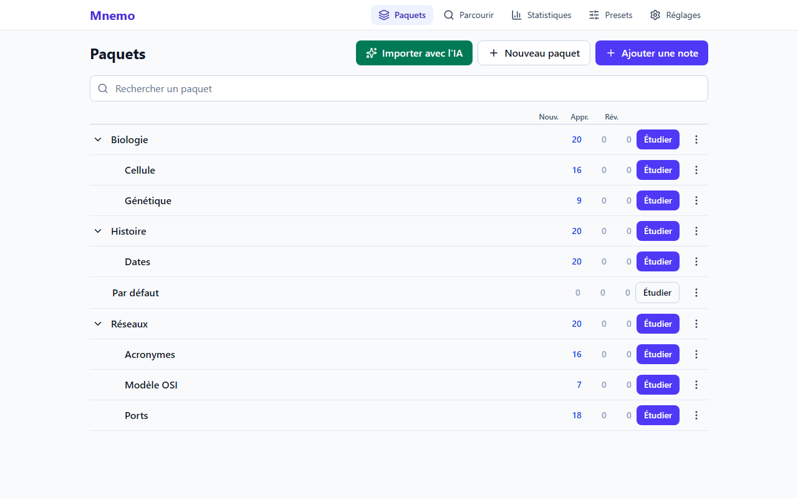
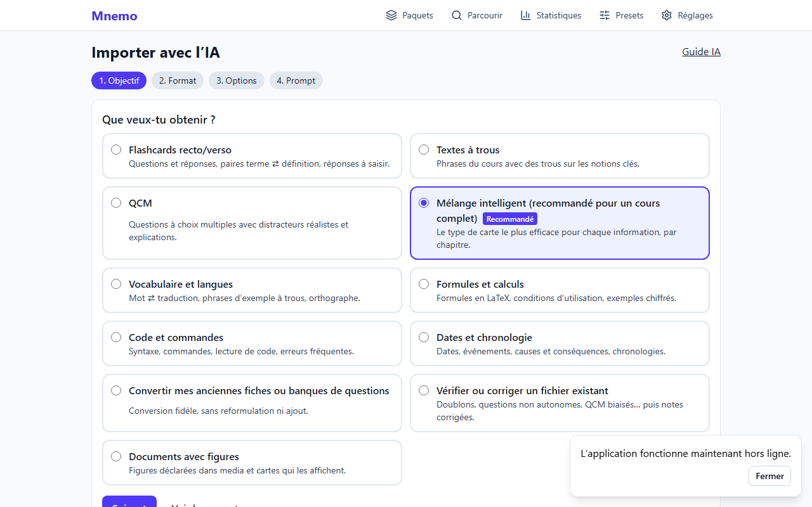
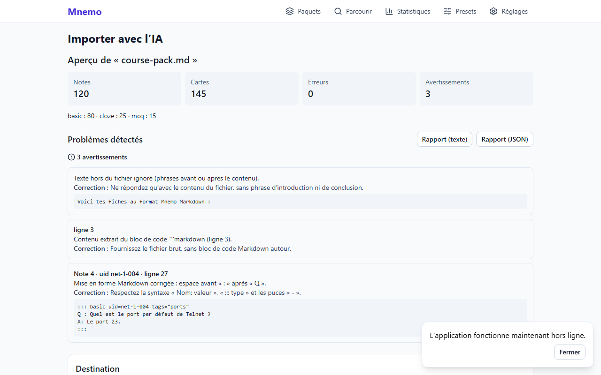
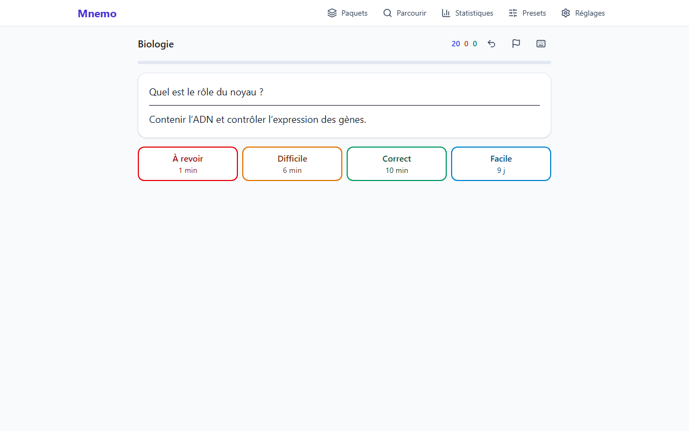
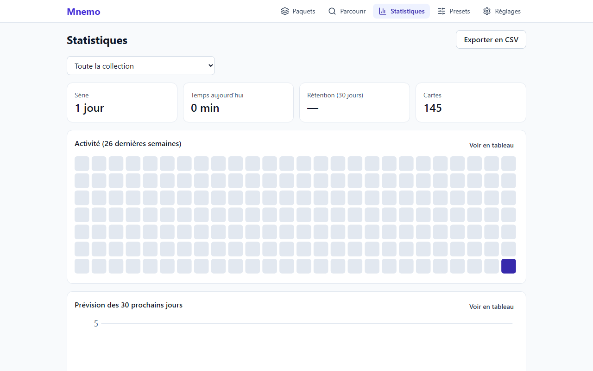

# Mnemo

**Configurable spaced repetition, with AI-friendly import.** Turn a whole course into reliable
review cards with any AI, study offline, and sync your devices through your own server.

[](https://github.com/OWNER/REPO/actions/workflows/ci.yml)
[](LICENSE)
[](https://github.com/OWNER/REPO/releases)

_Version française : [README.md](README.md)._



## Why Mnemo?

- **AI import comes first.** Mnemo writes the right prompt for you (flashcards, cloze deletions,
  multiple choice, smart mix…). You paste it into the AI of your choice with your course, then
  drop the answer: the preview shows the cards exactly as when studying, reports problems and,
  when needed, generates a **fix prompt** or a **“Continue”** prompt if the answer was cut off.
- **A fully configurable scheduling engine**: FSRS, SM-2, Anki-style, Leitner boxes or simple
  ladders, per-deck presets with inheritance, and a **workload simulator**.
- **Local-first**: everything works without an account, API key or network (installable PWA).
  No telemetry. Full export at any time (JSON, YAML, Markdown, CSV, zip, `.apkg`).
- **Online if you want**: the same code runs on your server (Docker) with accounts, API tokens
  and multi-device sync.
- **Accessible**: everything works with the keyboard, AA contrast, dark theme, adjustable text
  size, grading never conveyed by color alone.

## The 5-minute journey

```
course (PDF, text) ──► Mnemo writes the prompt ──► your AI ──► file ──► faithful preview ──► import ──► study
                                                       ▲                       │
                                                       └────── fix prompt ─────┘
```

| Import wizard                                 | Preview before import                           |
| --------------------------------------------- | ----------------------------------------------- |
|  |  |

| Study                                | Statistics                                |
| ------------------------------------ | ----------------------------------------- |
|  |  |

## Features

- **Card types**: front/back (and reversed), typed answer, cloze `{{c1::…::hint}}`, single or
  multiple answer MCQ, true/false, matching, ordering (drag and drop or keyboard), lists, custom
  template types. Markdown, LaTeX (KaTeX), highlighted code, tables, images.
- **Hints** (light bulb) from the most subtle to the most explicit, taken into account in grading.
- **Study**: predicted intervals on each button, keyboard shortcuts, undo of the last 10 actions,
  bury, suspend, flag, custom study (recent mistakes, ahead, by tag, cram), session summary.
- **Note browser** with filters, bulk actions and side-panel editing.
- **Statistics**: activity, forecast, true retention, intervals, buttons, hints, leeches;
  accessible charts with table alternatives, CSV export.
- **Import**: Markdown, YAML, JSON, CSV/TSV, zip bundles with media, Anki `.apkg`; tolerant
  cleanup of AI outputs, per-note validation, partial import, duplicate-free merge by `uid`,
  undo of every import.
- **Prompt library** (French and English): 11 tasks, 4 output formats, long documents (plan,
  batches, review), fix and continue prompts.
- **Integrations**: `mnemo` CLI, HTTP API with scoped tokens, **MCP** server so your AI
  assistant can validate then import directly (always after confirmation).

## Quick start

### 1. In the browser (nothing to install)

Open the version published on GitHub Pages (`https://OWNER.github.io/REPO/`), then “Install app”
in your browser to use it offline. Your data stays in your browser; remember to back up
(Settings → Backup).

### 2. Locally with a server (CLI, API and MCP share the same database)

Requirements: Node.js 22.13+ and pnpm 9.

```bash
git clone https://github.com/OWNER/REPO.git mnemo && cd mnemo
pnpm install
pnpm build
node apps/cli/dist/index.mjs serve        # http://127.0.0.1:8787, data in ~/.mnemo
```

Then, from another terminal:

```bash
node apps/cli/dist/index.mjs prompt --task course-pack --format md --lang en > prompt.txt
node apps/cli/dist/index.mjs validate ai-answer.md
node apps/cli/dist/index.mjs import ai-answer.md --deck "My course"
```

### 3. With Docker (self-hosting, accounts and sync)

```bash
cp .env.example .env      # set SESSION_SECRET, BASE_URL…
docker compose up -d
```

Full guide (French): [docs/SELF_HOSTING.md](docs/SELF_HOSTING.md).

### Development

```bash
pnpm dev          # web app on http://localhost:5173
pnpm check        # format, lint, types, tests, build
pnpm e2e          # end-to-end tests (Playwright)
```

## Documentation

The documentation is written in French: import format ([docs/IMPORT_FORMAT.md](docs/IMPORT_FORMAT.md)),
AI prompts ([docs/AI_PROMPTS.md](docs/AI_PROMPTS.md), which also contains the English templates),
schedulers ([docs/SCHEDULERS.md](docs/SCHEDULERS.md)), sync ([docs/SYNC.md](docs/SYNC.md)),
MCP ([docs/MCP.md](docs/MCP.md)), self-hosting, architecture, decisions, privacy and security
model in [docs/](docs/). Contributing: [CONTRIBUTING.md](CONTRIBUTING.md).

## Roadmap

Planned after v0.1.0: image occlusion, FSRS weight optimizer from your history, end-to-end
encrypted sync, desktop app (Tauri), import of the newer Anki format (`.anki21b`), visual card
template editor, deck sharing. Not planned: Anki add-on compatibility, mandatory AI.

## License

[MIT](LICENSE). Mnemo is an independent implementation: no code comes from Anki (see
[NOTICE](NOTICE)). The `{{c1::…}}` cloze syntax and the `.apkg` format are supported for
interoperability.
